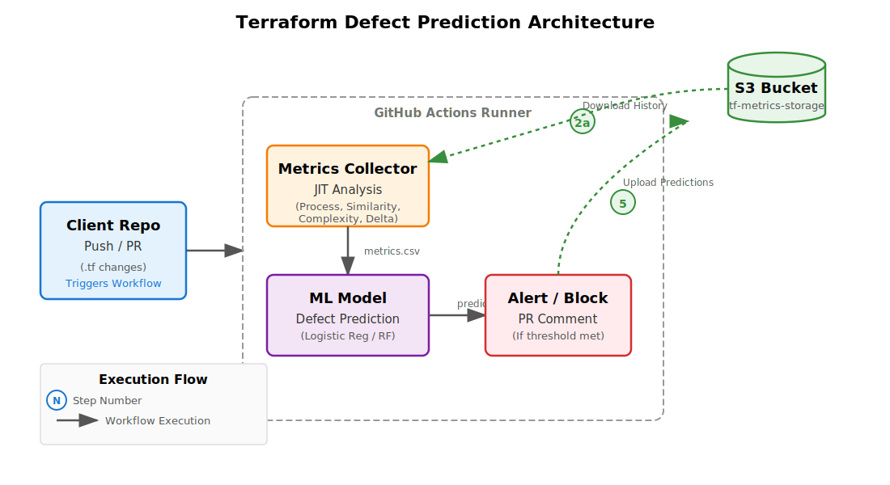

# MLOps Framework for Terraform Defect Prediction

This repository implements a robust **MLOps Framework** for predicting defects in Terraform infrastructure code. It demonstrates how to integrate continuous defect prediction into a CI/CD pipeline using reusable GitHub Actions hosted in the `stilab-ets` organization.

## 🤖 MLOps Capabilities

This framework is designed with **MLOps** principles at its core, ensuring the system is adaptable, scalable, and maintainable:

*   **Training Flexibility**:
    *   **Incremental Learning**: The model allows for continuous updates with new data without the need for full retraining (using `partial_fit`).
    *   **Online Learning**: Capable of adapting to codebase evolution in real-time as new commits are pushed.
*   **Data Collection Modes**:
    *   **From Scratch (Full History)**: Can process the entire Git history to build comprehensive training datasets.
    *   **Just-In-Time (JIT)**: Optimized for CI/CD to collect metrics only for immediate changes in the current commit.

## 🚀 Architecture

The pipeline consists of three main components:

1.  **Client Repository** (This repo): Contains Terraform code (`.tf`) and the workflow configuration (`.github/workflows/predict_defects.yml`).
2.  **Metrics Collector** (`stilab-ets/tf-metrics-collector`): Analyzes code changes and extracts software metrics.
3.  **ML Model** (`stilab-ets/tf-ml-defect-model`): Uses a pre-trained machine learning model to predict if changed blocks are defect-prone.

<div align="right">
  
</div>

## 🗄️ S3 Artifact Storage

The pipeline automatically manages artifacts in your configured **S3 Bucket** (`tf-metrics-storage`). This ensures data persistence and model versioning.

```
s3://tf-metrics-storage/
├── history/
│   └── prediction_history_master.csv    # Accumulated global history
├── metrics/
│   ├── metrics_current.csv              # Latest JIT metrics
│   └── metrics_history.csv              # Historical metrics context
├── predictions/
│   └── predictions_<COMMIT>_<TIME>.csv  # Prediction results (Versioned)
└── pre_trained_defect_models/           # ML Models
    ├── trained_models/
    │   └── logisticreg_model.joblib
    └── model_features/
```

**Key Features:**
*   **Automatic Versioning**: Every prediction run saves a file with the Commit Hash and Timestamp.
*   **Model Management**: Models are downloaded dynamically from `pre_trained_defect_models`.

## ⚡ How It Works (Just-In-Time)

This pipeline uses **Just-In-Time (JIT)** defect prediction to ensure fast feedback loops.

In `predict_defects.yml`, we enable JIT mode by passing the current commit hash:
```yaml
commit_hash: ${{ github.sha }}
```

This tells the Metrics Collector to look only at the lines you just changed.

### Effective Process Metrics (Optional History)
To ensure **process metrics** (like *Developer Experience* or *File Stability*) are measured effectively in JIT mode, the pipeline downloads `metrics_history.csv` from S3.

This provides the necessary historical context (e.g., "how many times has this developer changed this file?") without needing to re-process the entire repository history. This hybrid approach combines the speed of JIT with the accuracy of full history.

## 🛠️ Usage & Configuration

### 1. Prerequisites
You need the following **GitHub Secrets** configured in your repository:
*   `AWS_ACCESS_KEY_ID`
*   `AWS_SECRET_ACCESS_KEY`
*   `AWS_REGION`
*   `S3_BUCKET` (Where models and history are stored)

### 2. Workflow Inputs (`predict_defects.yml`)
You can customize the pipeline behavior by editing the workflow file:

| Input | Default | Description |
| :--- | :--- | :--- |
| `threshold` | `0.5` | Probability threshold (0.0 - 1.0). Higher = Less sensitive, Lower = More sensitive. |
| `model` | `logisticreg_model` | The ML model to use for prediction. |

## 📦 Maintenance & Updates

The actions are maintained in separate repositories. To update or modify the logic:

### Updating the Metrics Logic
*   **Repo**: [stilab-ets/tf-metrics-collector](https://github.com/stilab-ets/tf-metrics-collector)
*   **Update**: Modify `scripts/collect_metrics.py`.
*   **Release**: Push to `main`. The client will pick up changes automatically if it uses `@main`.

### Updating the ML Model
*   **Repo**: [stilab-ets/tf-ml-defect-model](https://github.com/stilab-ets/tf-ml-defect-model)
*   **Update**: Retrain models or modify `ml/services/user_training_service.py`.
*   **Release**: Push to `main`.
